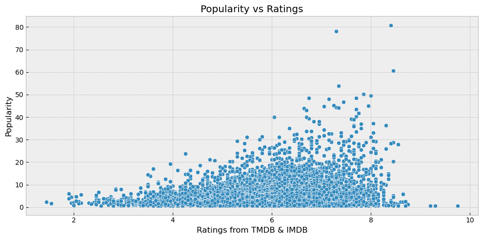

### Business Problem
---

Establishing a new movie production studio, Microsoft faces the formidable challenge of competing against industry giants armed with historical industry insights. To thrive in this competitive landscape, Microsoft needs to strategically determine the types of movies that are most likely to succeed in terms of profitability, ratings, and optimal release timing. 

This entails understanding audience preferences and aligning with market trends to ensure a strong start for the studio's debut film. However, with limited industry experience, Microsoft lacks the necessary data-driven approach to make informed decisions.

### Overview
---

To address this challenge, our project focuses on conducting thorough exploratory data analysis.

We've structured our approach into three key stages to ensure the acquisition of pertinent data for our analysis. In the initial phase, we'll delve into data from IMDB and TMDB to explore genres, ratings, and the popularity of movies. Subsequently, in the second stage, we'll dissect datasets from BOM and The Numbers, focusing on financial aspects such as production budgets, total gross revenue, and net revenue calculations. The third phase will serve as a comprehensive synthesis, merging insights derived from the earlier stages to understand connection between the initial data and the financial aspects of the movies. 

Our goal is to empower Microsoft with the necessary information to overcome their competition, establish a strong foothold in the industry, and pave the way for long-term success in the dynamic realm of movie production.

### Data & Methodology
---

**Initial Observation:**
Upon conducting our initial review of the datasets, we observe the presence of distinct columns containing diverse sets of data.

To address our business problem, our analysis will be divided into three parts:

1. The first part will focus on examining months, popularity, time, and genres. This exploration will rely on the following datasets:

* IMDB dataset
* 2 IMDB datasets

2. The second part centers around analyzing the financial aspects. For this purpose, we will utilize the following datasets:

* TN movies dataset
* BOM movies dataset

3. In the third phase, we combine both the creative and financial parts. We achieve this by merging the datasets from the first two steps using an inner merge. This helps make sure our data is complete and reliable without any missing values. While this consolidation might result in a reduction in the number of data points, it enhances the accuracy and reliability of our analysis. Despite the reduced numbers, we will still use this combined dataset for our analysis in this project. Additionally, we recognize the significance of addressing these limitations in future iterations, allowing for continuous improvement and refinement of our analysis.

This strategy enables us to glean insights from diverse movie industry dimensions, accounting for data quality and availability. It aligns with our business problem, aiming to offer a holistic comprehension of Microsoft's movie production studio endeavor.

### Initial Questions:
---

From our business problem, I've shaped some initial questions that align with our goals and data exploration:

1. What is the relationship between popularity and movie ratings?
2. Does the duration of a movie influence its ratings?
3. Which genre has the highest ratings on average?
4. How do the highest grossing movies compare to their net revenue?
5. Which genres generate the highest revenue in the movie industry?

These questions will steer us in the direction we need to take on this journey as we work to address and resolve this problem.

### Results
---

The figure displays the relationship between popularity and average ratings in the dataset, revealing a positive correlation. As movie popularity and the number of ratings increase, the average user ratings also tend to rise, indicating a common trend where users rate movies they enjoy. 

Interestingly, the data also shows that some movies with high average ratings have received relatively fewer ratings, highlighting instances where high quality may not necessarily coincide with high popularity.

Movie durations appear to have a limited influence on ratings, as shown by the scatter plot. Movies of different lengths have garnered both high and low ratings, implying that duration alone isn't a significant predictor of a movie's popularity based on user ratings. 

The plot also highlights that a majority of movies fall within the 80-120 minute range, which seems to resonate well with viewers.

The bar chart of average ratings reveals that genres such as news, documentary, biography, and history receive the highest average ratings, while action, thriller, and horror genres receive the lowest. 

This suggests that viewers tend to vote more for movies they consider average, possibly indicating their inclination to voice dissatisfaction with below-average scores for films that disappoint their expectations. 

This underscores the importance of meeting genre-specific expectations for movie success.

The top 15 movies with the highest total gross revenue encompass a variety of genres, including action, adventure, fantasy, and animation. This diversity implies that a movie's financial success is influenced by factors beyond its genre, such as marketing strategies, casting choices, and engaging storylines. 

Notable movie samples in this list, such as "Avatar," "Star Wars," "Titanic," "Avengers," "Jurassic Park," "Incredibles," and "Frozen," reflect a mix of genres and popularity. These movies might appeal to a wide range of audiences, including families seeking entertainment, thereby contributing to their high revenue. 

This suggests that a successful movie's ability to capture diverse viewer interests is a key factor in achieving substantial total gross revenue.

The top 15 movies that earn the most money also show up frequently in the list of top 15 movies with the highest profits. This means that movies that do well at the box office also tend to make a lot of profit. 

We want to find out if spending more money on making a movie results in more earnings. This will help us understand if investing more in making movies leads to making more money from them.

The analysis of production budgets in relation to gross and net revenue provides interesting insights. It appears that there is a positive correlation between higher production budgets and both higher gross and net revenue. This suggests that investing more in the production of a movie could potentially lead to higher earnings at the box office and greater overall profitability. 

However, it's important to note that while there is a general trend of higher budgets being associated with higher revenues, there are also instances where movies with lower budgets have managed to achieve significant financial success. This indicates that factors beyond just budget, such as story, marketing, and audience reception, also play a crucial role in determining a movie's financial performance.

Examining the movie genres that generate the highest total gross revenue offers intriguing insights into audience preferences and financial success. While the top genres—Animation, Adventure, and Sci-Fi—may not necessarily receive the highest ratings, they consistently secure top positions in terms of earnings. 

Interestingly, Documentary and News genres, which receive higher ratings, often have minimal earnings. This indicates that financial success isn't solely dependent on critical acclaim, and genres that resonate well with audiences tend to result in higher profits. 

Microsoft's new movie studio could leverage this information to strategize their film production approach. They might consider creating movies in genres that have proven to be financially lucrative, while also exploring opportunities to blend higher-rated genres with those that yield substantial revenue. 

This could provide a balanced approach to attract both audiences and earnings.

### Conclusion:
---

In this analysis, we embarked on a comprehensive exploration of various dimensions within the movie industry to aid Microsoft's new movie production studio. Our investigation encompassed factors such as genres, ratings, popularity, and financial aspects. 

Notably, we observed consistent correlations between movie popularity, ratings, and commercial success, emphasizing the importance of understanding audience preferences and aligning with market trends. Additionally, we identified that top-grossing movies often lead in net revenue, reinforcing the notion that financial achievements at the box office translate into profits.

# Suggestions:
---

Based on our findings, we recommend the following strategies to Microsoft:

 - **Genre Diversity:** The top-performing movies encompass various genres, indicating that a diverse content portfolio can attract a wider audience.

 - **Optimized Investment:** While higher production budgets can contribute to revenue, it's essential to strike a balance. Careful evaluation of each project's potential is crucial for maximizing returns.

 - **Quality Focus:** The strong correlation between popularity, ratings, and revenue underscores the importance of delivering high-quality content that resonates with viewers.

 - **Continuous Adaptation:** Ongoing analysis and monitoring of market trends and audience preferences will be instrumental in maintaining competitiveness in the ever-evolving movie industry.

By implementing these strategies, Microsoft can establish itself as a formidable player in the movie production landscape, appealing to audiences and achieving both creative and financial success.